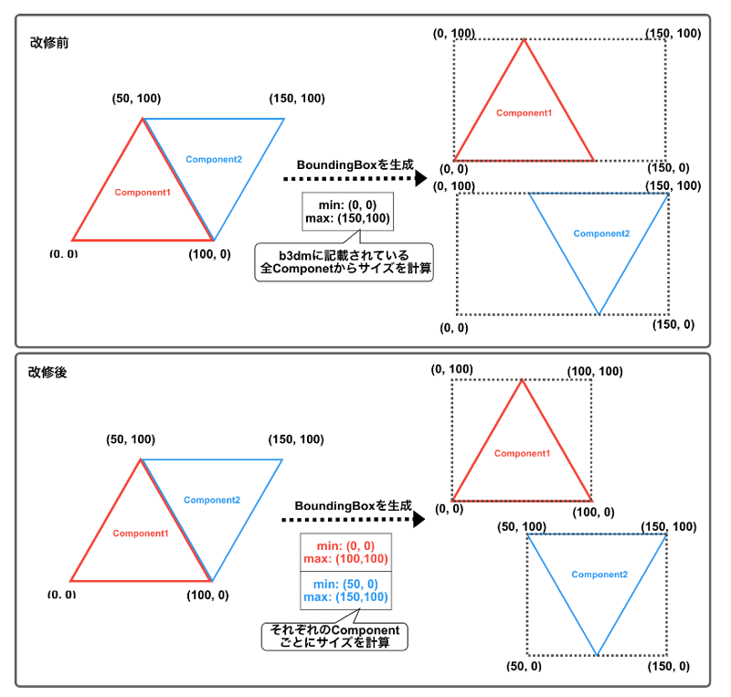

# FY2022 Project PLATEAU UC22-030「防災エリアマネジメントDX」の成果物
### 大規模人流シミュレーション用 UE4 Cesium for Unreal改修リポジトリ

## 概要
PLATEAUの3D都市モデルを利⽤した⼈流シミュレーションをするために必要なCesium for Unreal の改修の内容です。

Cesium for UnrealはUnreal Engineに3Dモデルを取り込むためのプラグインで、概要は[Cesium for UnrealのREADME](https://github.com/CesiumGS/cesium-unreal)をご参照ください。

## 「防災エリアマネジメントDX」について
令和4年度の3D都市モデルを活用した⺠間サービス創出型ユースケース開発業務「防災エリアマネジメントDX」において、エリア防災計画の更新やステークホルダとの合意形成における有効性検証を⽬的に、⾼輪ゲートウェイエリアの3D都市モデルを利⽤し、1万⼈規模の⼈流シミュレーション環境（誘導・避難シミュレーション）を構築しました。

⼤規模な⼈流シミュレーション環境を構築する上で、Cesium for Unrealには以下の課題がありました。

 - Characterの移動可能領域が⽣成されず、移動シミュレーションを実施することができない
 - BoundingBoxのサイズが最適ではなく、1万⼈規模の移動シミュレーションを実施する場合に性能が出ない

## 改修内容
### 移動可能領域の生成
Cesium for UnrealではUnreal Engineに取り込んだ3D都市モデルに対して、NavMeshが⽣成できず(図1)、キャラクターがスタート地点からゴール地点までの移動経路をが探索できず、結果としてキャラクターの移動シミュレーションが実施できないという課題がありました。

図1：改修前のNavMesh計算後の様子

上記の課題を解決するために、Cesium for Unrealのモデル読み込み時にNavMeshの計算を実⾏する改修を⾏いました。
この改修により、Cesium for Unrealで取り込んだ3D都市モデルに対してもNavMeshが⽣成ができ（図2）、シミュレーション実⾏時に移動経路探索が可能となりました。

図2：改修後のNavMesh計算後の様子

### BoundingBoxの最適化
Cesium for Unrealは3D Tilesのb3dm内に記載された情報からBoundingBoxのサイズを決定していますが、1つのb3dm内に複数のComponentの情報が存在する場合、全てのComponentに対して同じサイズでBoundingBoxが設定されており、実際のサイズよりも⼤きなサイズのBoundingBoxが⽣成されていました。
例として、今回のユースケースの対象となる⾼輪ゲートウェイの3Dモデルは1つのb3dmとそのb3dm内に10個のComponentが存在していますが、10個全てに⼤きなサイズのBoundingBox が⽣成されていました（図3)。
BoundingBoxはシミュレーション時の各アクター間の衝突計算を実⾏するための範囲を決めるものでもあり、サイズが⼤きくなると、BoundingBoxの重なりが多く発⽣し、計算実⾏回数が増加する等でシミュレーション負荷が上がるという課題がありました。

図3-a: 改修前の高輪GWモデルでのBoundingBox(モデル全体)

図3-b: 改修前の高輪GWモデルでのBoundingBox(Component単位)

上記の課題を解決するために、BoundingBoxをComponentのサイズに合わせて⽣成するようにCesium for Unrealの改修を⾏いました。
具体的には、Cesium for Unrealで各Componentに対するBoundingBoxのサイズを計算する際にb3dmファイル内に記載された全てのComponentのポリゴン間の距離を対象に計算を⾏っている箇所を、各Componentのポリゴン間の距離だけを対象に計算するように修正しました(図4) 。

図4: BoundingBox最適化の改修内容の概念図

上記の改修をすることで、各Componenに適切なサイズのBoundingBoxを⽣成することができ（図5）、シミュレーション時における衝突判定の計算負荷を下げることができました。

図5: 改修後のGWモデルでのBoundingBox

## ライセンス <!-- 定型文のため変更しない -->
* ソースコードおよび関連ドキュメントの著作権は国土交通省に帰属します。
* 本ドキュメントは[Project PLATEAUのサイトポリシー](https://www.mlit.go.jp/plateau/site-policy/)（CCBY4.0および政府標準利用規約2.0）に従い提供されています。

## 注意事項 <!-- 定型文のため変更しない -->

* 本レポジトリは参考資料として提供しているものです。動作保証は行っておりません。
* 予告なく変更・削除する可能性があります。
* 本レポジトリの利用により生じた損失及び損害等について、国土交通省はいかなる責任も負わないものとします。

## 参考資料　 <!-- 各リンクは納品時に更新 -->
* （近日公開）技術検証レポート: https://www.mlit.go.jp/plateau/libraries/technical-reports/
* PLATEAU Webサイト Use caseページ「防災エリアマネジメントDX」: https://www.mlit.go.jp/plateau/use-case/uc22-030/
* Cesium for Unreal：https://github.com/CesiumGS/cesium-unreal
